# Um projeto criado para fins de praticas com REACT JS 
 - Link da referencia e clone https://www.youtube.com/watch?v=y99YgaQjgx4&t=19608s (
  How To Create Full Stack E-Commerce Website Using React JS, MongoDB, Express & Node JS 2024) 
 - O projeto é um ecommerce front end com varias paginas de acessos para o usuario 

 # Imagens da pagina home  
 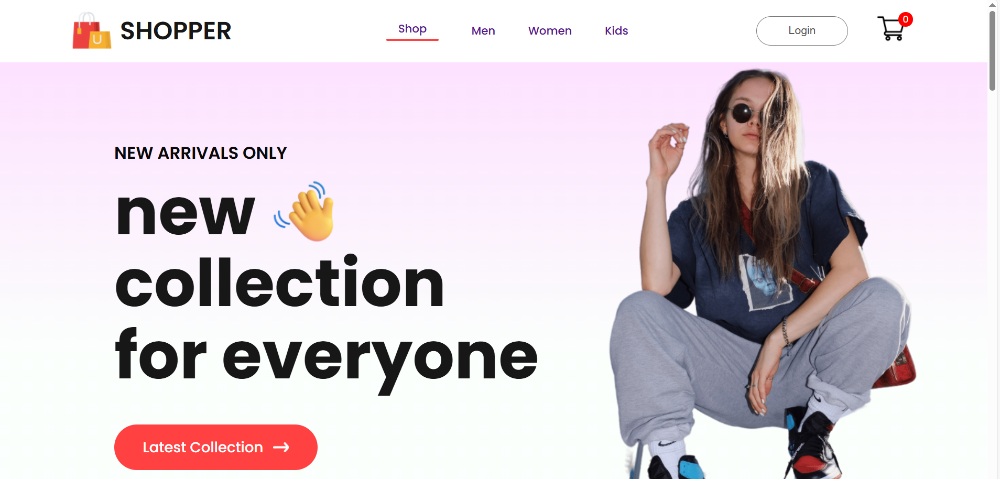 
 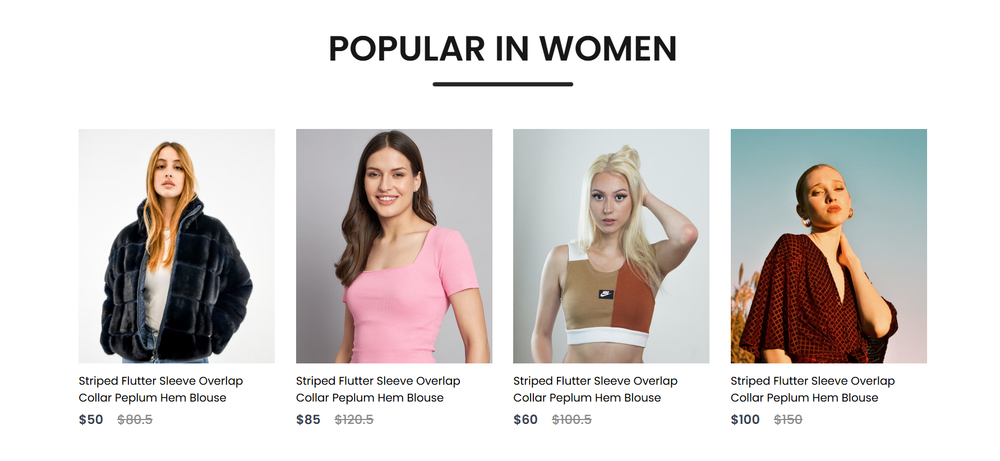
 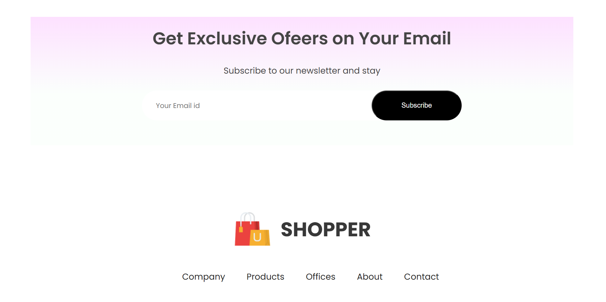

# Pagina Men 
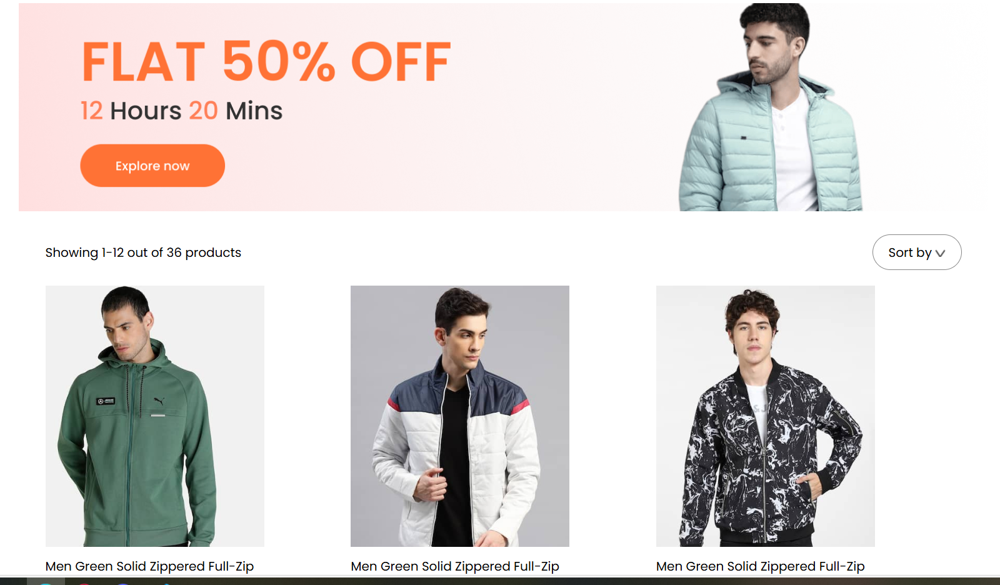
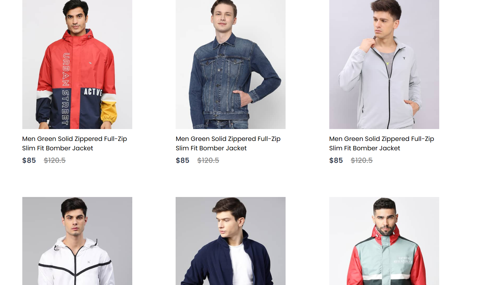
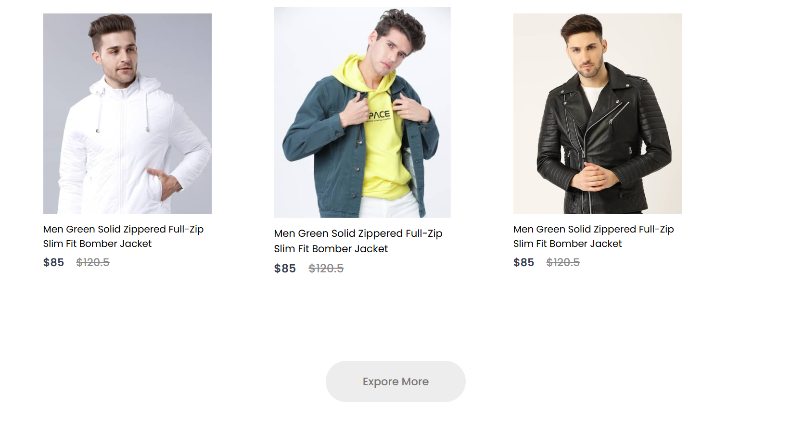

# Pagina de login 
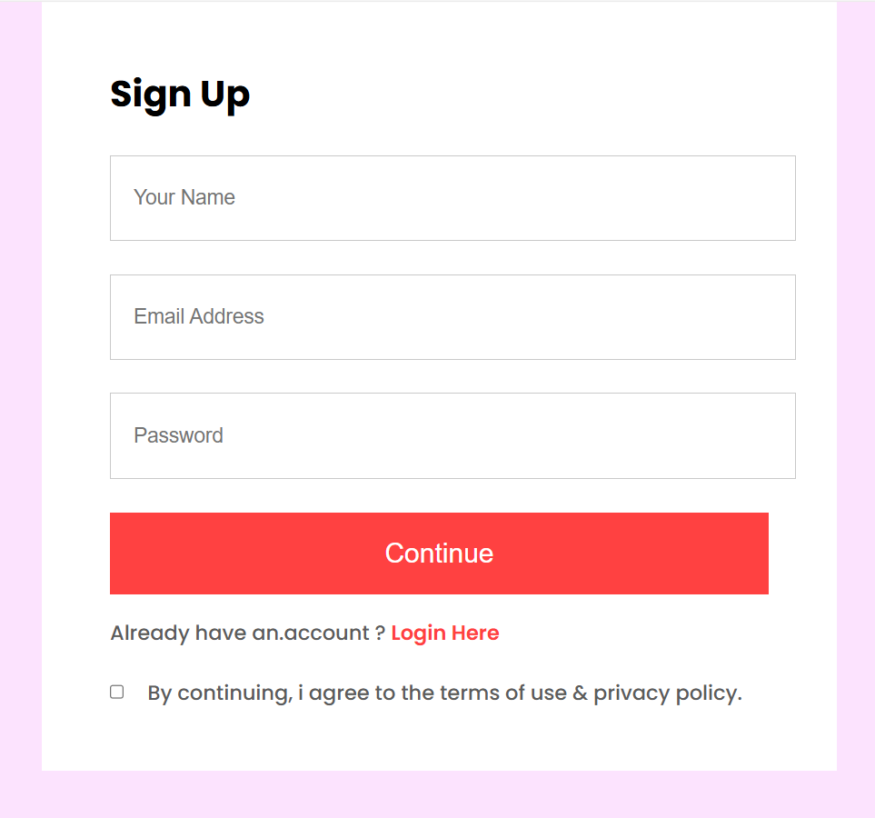

# Pagina carrinho 
- Podendo remover os produtos do carrinho ou adicionar eles 
- E caso adicionar irá se somando no carTotal 
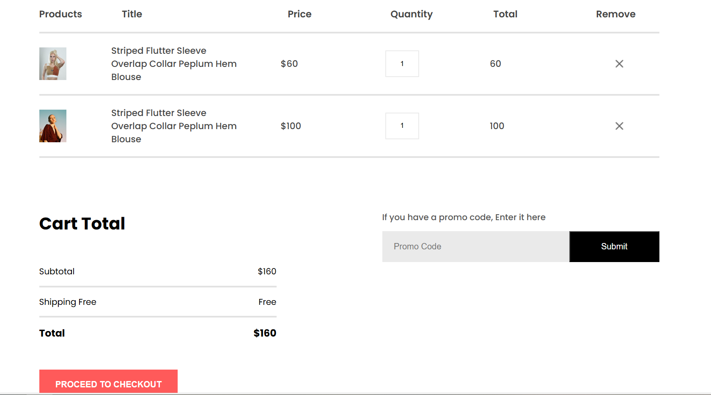

# Responsividade 
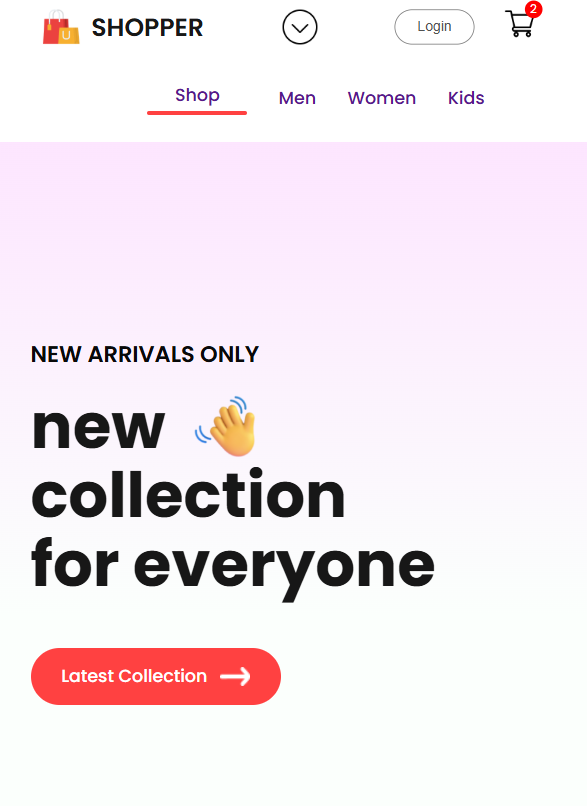

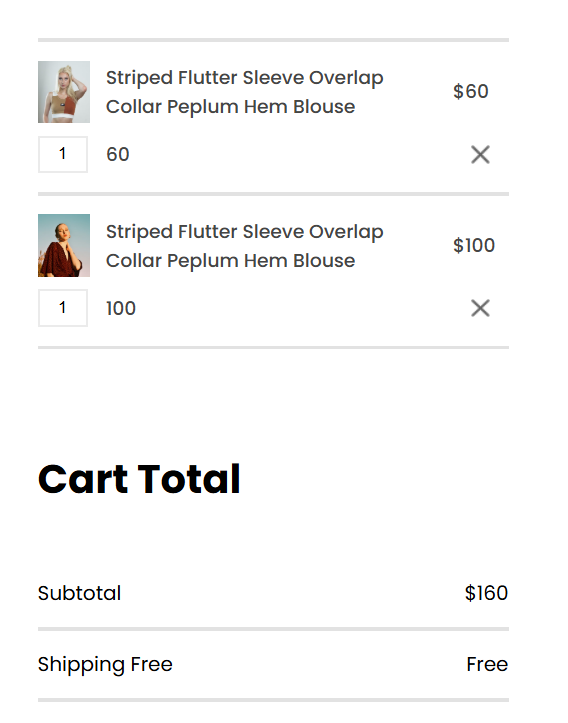
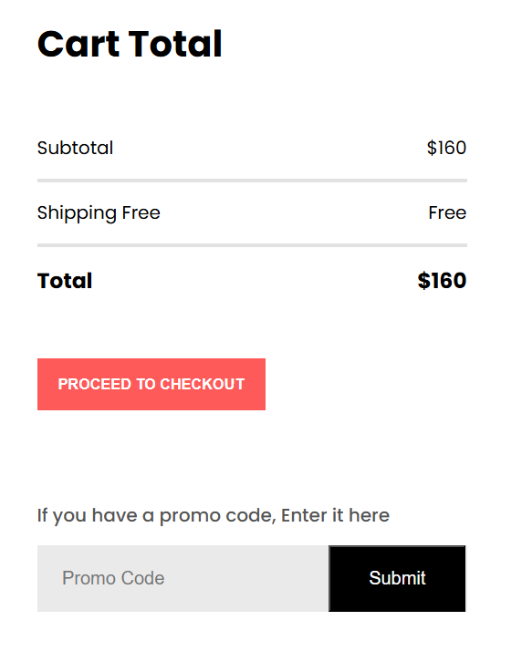
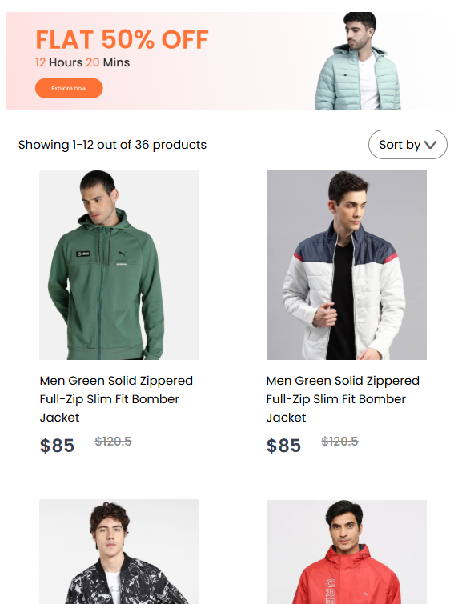